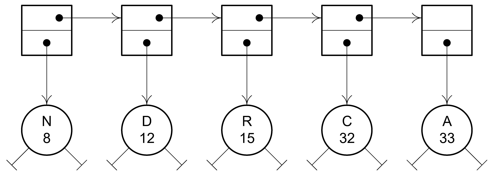
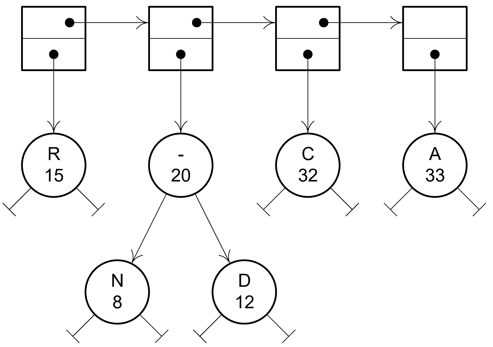
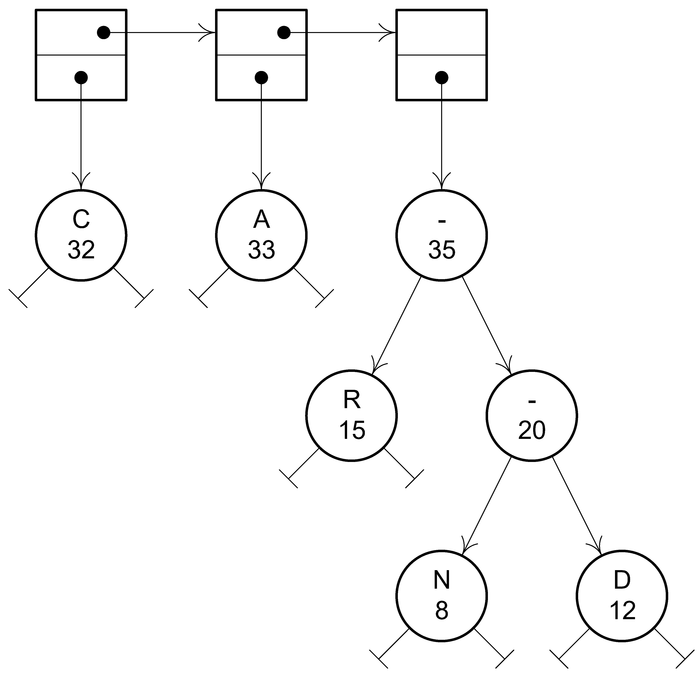
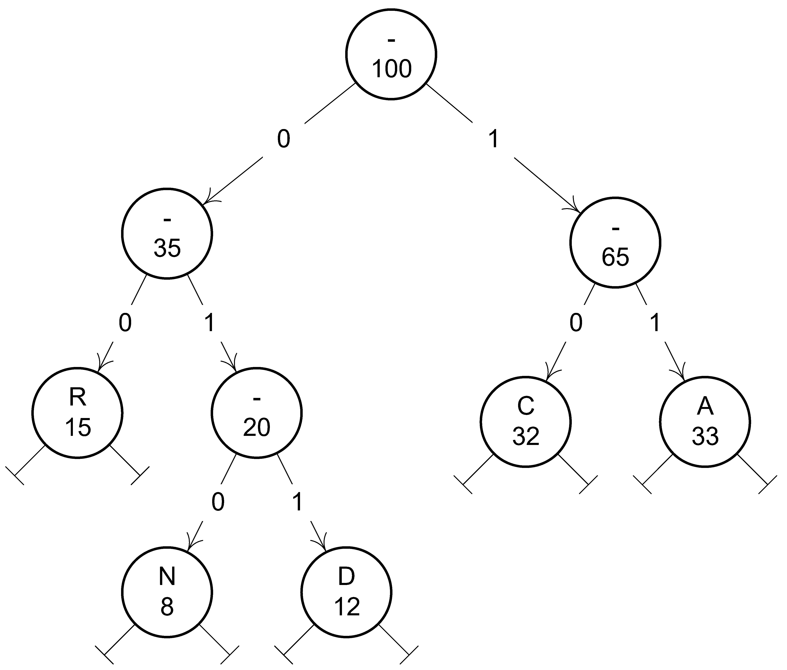
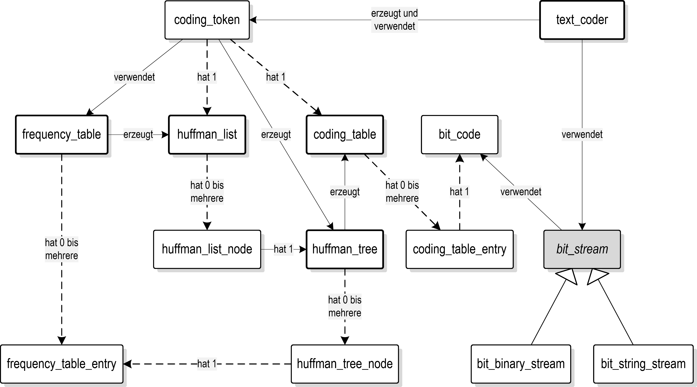

# **SWO3-Übungen - WS2023/24 - Übungszettel 6**

## **Beispiel 1: Textcodierung nach Huffman**

Zur Textcodierung nach Huffman findet man z.B. bei [www.itwissen.info][101] das
Folgende:

Die Huffman-Codierung ist ein verlustfreies Codierverfahren für die Text- und
Bildkompression. Das Verfahren basiert auf der Redundanz, der Zeichenhäufigkeit
und der statistischen Verteilung der Daten einer Information. So treten
beispielsweise in einem Text bestimmte Buchstaben häufiger auf als andere, so
der Buchstabe "e", der häufiger vorkommt als andere. In einer Grafik sind
hingegen die Farben statistisch verteilt: Grün kann beispielsweise häufiger
vorkommen als Gelb. Bei der Huffman-Codierung, die nach dessen Erfinder David
Huffman (1925-1999) benannt ist, ersetzt man den am häufigsten vorkommenden
Datensatz durch einen kurzen Signalcode, seltener vorkommende Datensätze werden
hingegen durch längere Signalcodes ersetzt. Die am häufigsten auftretenden
Zeichen werden mit nur 3 Bit übertragen, das bedeutet, dass man bei einem
Zeichen 5 Bit einspart. Manche, selten auftretende Zeichen werden sogar mit mehr
als acht Bit übertragen. Die Länge des Codes ist also variabel und wird in der
Huffman-Codierung anhand der Häufigkeit festgelegt. Dabei wird die Häufigkeit
der einzelnen Buchstaben oder Farbpixel ermittelt, Buchstaben bzw. Farbpixel mit
geringerer Häufigkeit werden in Gruppen zusammengefasst und aus denen werden in
einer Baumstruktur wiederum neue Gruppen gebildet. Je nach Zusammensetzung der
Signale können so bis zu 50% und mehr der Übertragungszeit eingespart werden.
Die Huffman-Codierung wird im H.320 und anderen Video-Codecs, in der Gruppe-3
Fax, bei MNP 5 und in JPEG verwendet.

Schreiben Sie mit diesem Hintergrundwissen ein objektorientiertes C++-Programm,
welches das Folgende leistet:

1. Es liest einen "langen" Text aus einer Textdatei mit Hilfe von
   `std::istream`s ein. Verwenden Sie zum Testen am einfachsten "normale" Texte.

1. Es bestimmt für jedes im Text vorkommende Zeichen dessen relative Häufigkeit.
   Die Summe der relativen Häufigkeiten für alle im Text vorkommenden Zeichen
   muss natürlich 100% ergeben.

1. Es druckt eine "ansprechend" formatierte Tabelle mit den relativen
   Zeichenhäufigkeiten aus. Diese Tabelle ist nach den Zeichenhäufigkeiten
   absteigend sortiert.

1. Es erzeugt aus dem eingelesenen Text und unter Zuhilfenahme der
   Zeichenhäufigkeiten einen Huffman-Baum.

1. Es druckt eine "ansprechend" formatierte Codierungstabelle sowie den
   Huffman-Baum aus. Die Codierungstabelle ist nach den im Text enthaltenen
   Zeichen aufsteigend sortiert.

1. Es codiert den eingelesenen Text anhand des Huffman-Baums.

1. Es druckt Statistiken, wie z.B. Kompressionsrate und Textlängen,
   "ansprechend" formatiert, aus.

1. Es decodiert den zuvor codierten Text und überprüft das Ergebnis auf
   Identität mit dem ursprünglich eingelesenen Text.

*Ein Beispiel:* Sei der eingelesene Text die Zeichenkette

>AACCCNNDDDAACCCCCRRAACCCCNNNADDDDDCCCAAACCNAAAAACCDDDDRRAAAANCCCRRAAAAARRRCCCCAARRAAAAAAACCCRRRRNCCC

Daraus ergibt sich die folgende Tabelle mit den relativen Zeichenhäufigkeiten
(siehe in der Tabelle unten die Spalte $p$).

*Anmerkung:* Ein Eintrag in dieser Tabelle wird als Paar $(c,p)$ bezeichnet.
Nach der Erzeugung des Huffman-Baums -- dessen Konstruktionsbeschreibung weiter
unten folgt -- lässt sich die folgende Codierungstabelle ausdrucken (siehe in
der Tabelle unten die Spalte **Code**).

|$c$|$p$|Code|
|:-:|--:|---:|
| A |33%|  11|
| C |32%|  10|
| R |15%|  00|
| D |12%| 011|
| N | 8%| 010|
|   |   |    |

Obiger Text lautet, codiert und binär dargestellt, nun wie folgt:

>11111010 10010010 01101101 11111101 01010100 00011111 01010100 10010010
>11011011 01101101 11010101 11111101 00101111 11111110 10011011 01101100
>00111111 11010101 01000001 11111111 10000001 01010101 11100001 11111111
>11111101 01000000 00001010 1010

Es ergibt sich eine Ersparnis von ca. 73% gegenüber einer "gewöhnlichen"
Darstellung mit 8 Bit pro Zeichen. Auch wenn man nur 3 Bit pro Zeichen -- dem
Mindestmaß für dieses Beispiel -- veranschlagt, ergibt sich noch immer eine
Kompressionsrate von ca. 27%.

Nun aber zur Beschreibung eines Algorithmus in vier Schritten, der einen
Huffman-Baum aus einer Tabelle mit relativen Zeichenhäufigkeiten erzeugt:

1. Der Algorithmus startet, indem er für jedes Paar $(c,p)$ aus der Tabelle der
   Zeichenhäufigkeiten einen binären Baum der Höhe 0 erzeugt und dann jeden
   dieser Bäume nach $p$ aufsteigend sortiert in eine lineare Liste hängt.
   Abbildung 1 zeigt das Resultat dieses ersten Schritts für das oben angegebene
   Beispiel.

   *Abbildung 1:* Das Resultat des ersten Konstruktionsschritts

2. Nun entnimmt der Algorithmus die ersten beiden Listeneinträge $(c_1,p_1)$ und
   $(c_2,p_2)$ aus der Liste (entnehmen bedeutet, dass die Daten aus der Liste
   entfernt werden) und generiert daraus einen Baum. Die Wurzel des neuen Baums
   berechnet sich zu $(-,p_1+p_2)$, der erste Listeneintrag $(c_1,p_1)$ wird zum
   linken, der zweite Listeneintrag $(c_2,p_2)$ zum rechten Sohn dieser neuen
   Wurzel.

3. Der neue Baum wird entsprechend seiner Häufigkeit $p_1+p_2$ wieder
   aufsteigend sortiert in die lineare Liste eingefügt. Anschließend geht es
   weiter bei Schritt 2. Die Abbildungen 2 und 3 zeigen den Inhalt der linearen
   Liste nach ein- bzw. zweimaligem Anwenden der Schritte 2 und 3.

   *Abbildung 2:* Das Resultat des zweiten Konstruktionsschritts

   *Abbildung 3:* Das Resultat nach zwei Iterationen

4. Der Algorithmus iteriert so lange, solange sich noch mehr als ein Baum in der
   Liste befindet. Das Endergebnis für das oben angegebene Beispiel zeigt
   Abbildung 4.

   *Abbildung 4:* Der fertige Huffman-Baum

Ihr C++-Programm muss auf der obersten Abstraktionsebene wie folgt strukturiert
sein: Es besteht aus den Klassen `text_coder`, `huffman_tree` und
`huffman_list`. Die Klasse `text_coder` bietet Ver- und Entschlüsselungsmethoden
an und erledigt ihre Aufgabe mit Hilfe der Klasse `coding_token`. Die Klasse
`huffman_tree` repräsentiert einen Huffman-Baum und wird ihrerseits von der
Klasse `huffman_list` verwendet. Entwerfen Sie die weitere Struktur Ihres
Programms selbst, achten Sie vor allem auf eine saubere Trennung der
individuellen "Agenden" der einzelnen Klassen. Verwenden Sie das Prinzip der
Datenkapselung so oft als möglich, implementieren Sie kleine Hilfsklassen wie
z.B. einen `bit_stream`. Siehe Abbildung 5 für einen Designvorschlag.

*Abbildung 5:* Ein mögliches Design

### **Literatur**

[Huffman, 1952] David Huffman. A Method for the Construction of
Minimum-Redundancy Codes. Proceedings of the Institute of Radio Engineers,
40:1098–1101, September 1952.

[101]: https://www.itwissen.info/Huffman-Codierung-Huffman-encoding.html
