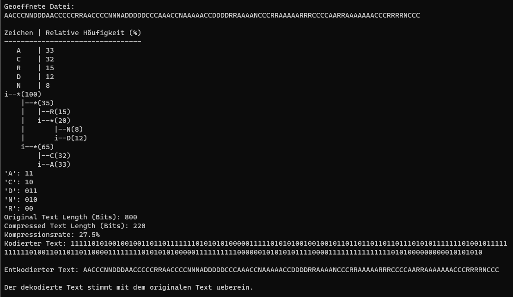
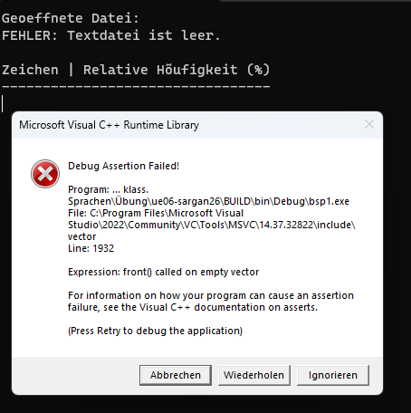
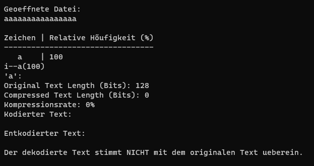
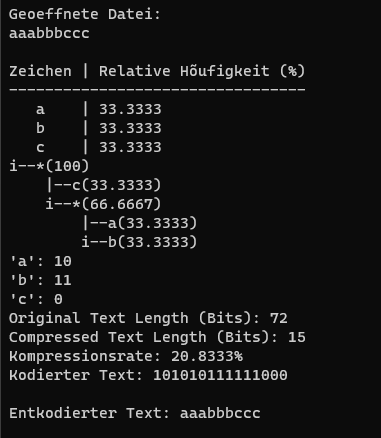

# **SWO3-Übungen - WS2023/24 - Übungszettel 6 - Ausarbeitung**

## **Beispiel 1**

### **Lösungsidee**

#### Datenstrukturen und Algorithmen

**FrequencyTable-Klasse**: Diese Klasse ist für das Einlesen eines Textes aus einer Datei zuständig. Sie erstellt eine Häufigkeitstabelle ('std::map<char, int>') für die Zeichen im Text und berechnet ihre relativen Häufigkeiten. Der eingelesene Text wird für die spätere Verarbeitung gespeichert.

**HuffmanTree-Klase**: Basierend auf der Häufigkeitstabelle aus der 'FrequencyTable'-Klasse erstellt diese Klasse einen Huffman-Baum. Jeder Knoten des Baumes ('HuffmanTreeNode') repräsentiert ein Zeichen und seine Häufigkeit. Der Baum wird unter Verwendung einer Prioritätswarteschlange ('std::priority_queue') konstruiert.

**Codierung und Decodierung**: Innerhallb der 'HuffmanTree'-Klasse wird eine Codierungstabelle erstellt, die jedem Zeichen einen eindeutigen Binärcode zuweist. Der Text wird kodiert, indem jedes Zeichen durch seinen Binärcode ersetzt wird. Für die Decodierung wird der codierte Text durch den Huffman-Baum navigiert, um den ursprünglichen Text wiederherzustellen.

**Statistiken**: Die Methode 'encodeText' in der 'HuffmanTree'-Klasse berechnet und druckt Statistiken aus, wie die Länge des Originaltexts und des kodierten Texts sowie die Kompressionsrate.

#### Grundstruktur der Implementierung

**Hauptklassen**: 'FrequencyTable' und 'HuffmanTree'.
  - 'FrequencyTable' kümmert sich um das Einlesen des Textes und das Erstellen der Häufigkeitstabelle.
  - 'HuffmanTree' ist verantwortlich für das Erstellen des Huffman-Baums, das Codieren und Decodieren von Text und das Ausgeben von Statistiken.

**Hilfsklassen**: 'HuffmanTreeNode' repräsentirt die Knoten des Huffman-Baums.

**Wichtige Methoden**:
  - 'FrequencyTable::readFile': Liest den Text und erstellt die Häufigkeitstabelle.
  - 'HuffmanTree::createEncodingTable': Erstellt die Codierungstabelle basierend auf dem Huffman-Baum.
  - 'HuffmanTree::encodeText' und 'HuffmanTree::decodeText': Methoden zum Codieren und Dekodieren des Textes.

### **Testfälle**

Normaler Testfall

Leerer String

Nur gleiche Zeichen

Gleiche Häufigkeit

